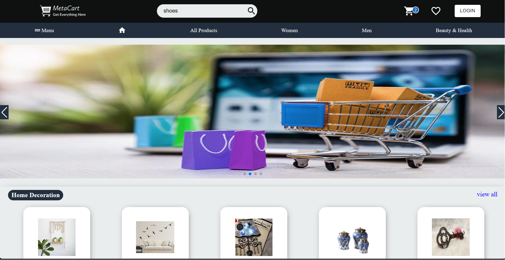
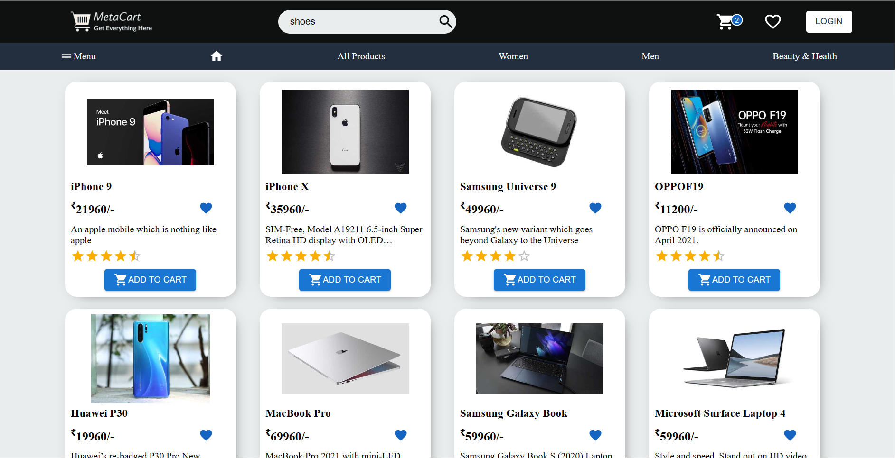
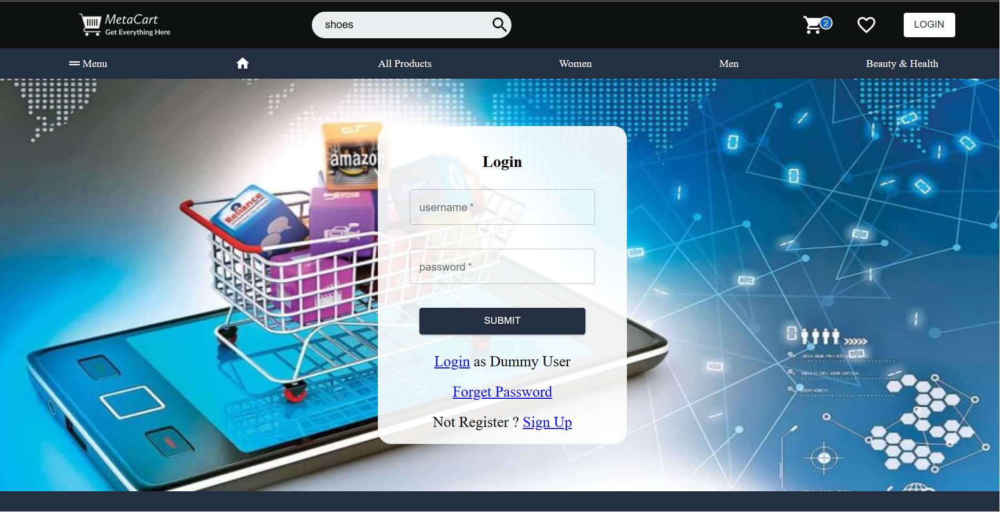
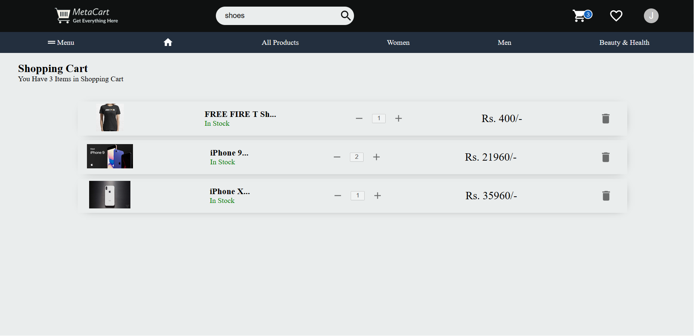
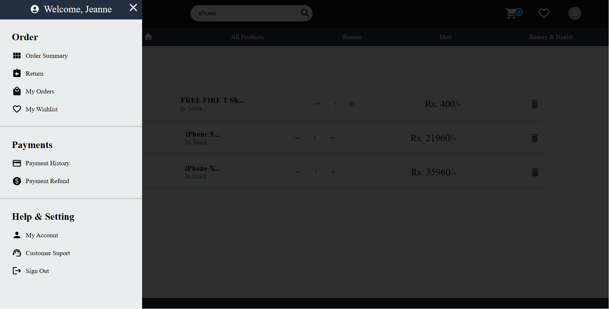
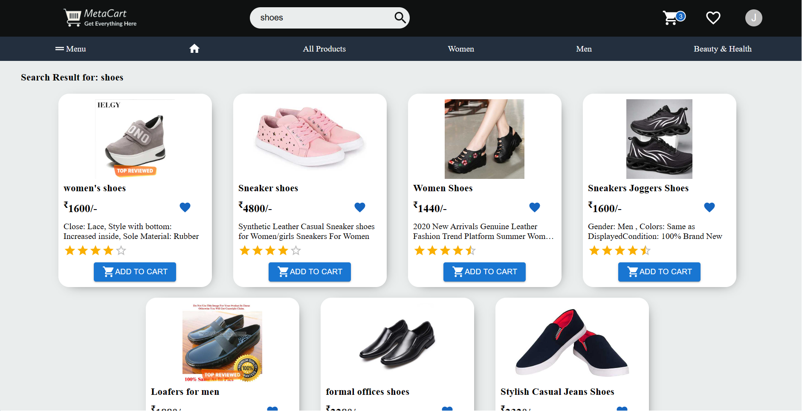

<!--
*** Thanks for checking out my Project. If you have a suggestion
*** that would make this better, please fork the repo and create a pull request
*** or simply open an issue with the tag "enhancement".
*** Don't forget to give the project a star!
*** Thanks again! Now go create something AMAZING! :D
-->

<!-- PROJECT SHIELDS -->

[![LinkedIn][linkedin-shield]](https://www.linkedin.com/in/niket-kumar-mishra-37ab5a215/)

<!-- PROJECT LOGO -->
 

  

 

  <h3 align="center">MetaCart Shopping</h3>

  

    An awesome E-com plateform to buy Products!
     
    <a href="https://meta-cart.netlify.app/"><strong>Explore App »</strong></a>
     
     
    <a href="https://meta-cart.netlify.app/">View Demo</a>
    ·
    <a href="https://github.com/niketvns/metacart/issues">Report Bug</a>
    ·
    <a href="https://github.com/niketvns/metacart/pulls">Request Feature</a>
  

<!-- TABLE OF CONTENTS -->

  
Table of Contents

  <ol>
    <li>HomePage</li>
    <li>Login/Logout</li>
    <li>Sign Up</li>
    <li>Payment (paypal)</li>
    <li>Search Products</li>
    <li>View Products</li>
    <li>Add to wishlist</li>
    <li>Add to Cart</li>
    <li>Single Product Page</li>
    <li>Responisve</li>
  </ol>

<!-- ABOUT THE PROJECT -->
## About The Project

There are many great Shops ; however, I didn't find one that really suited my needs so I created this enhanced one. I want to create a shop on fashion that'll be the last one you ever need -- I think this is it.

Here's why:
* Your time should be focused on only something you really need. A project that solves a problem and helps others.
* You shouldn't be search again and again for same type of products.

Of course, no shop will serve all products since your needs may be different. So I'll be adding more features in the near future. You may also suggest changes by forking this repo and creating a pull request or opening an issue. Thanks to all the people have reviewed to expanding this CL!

### Built With

* [HTML](https://www.w3schools.com/html/)
* [CSS](https://www.w3schools.com/css/)
* [React.js](https://reactjs.org/)
*[Dummy Json](https://dummyjson.com/docs)

(<a href="#top">back to top</a>)

### Prerequisites

You don't need anything special, just open the link and view videos.

PAYMENT DUMMY ACCOUNT FOR REVIEW

 ID: sb-lfuwq15229978@personal.example.com

 PASSWORD: 48lnxx$Z

Use This ID, Password for Payment by PayPal

<!-- ROADMAP -->

## Contributing

Contributions are what make the open source community such an amazing place to learn, inspire, and create. Any contributions you make are **greatly appreciated**.

If you have a suggestion that would make this better, please fork the repo and create a pull request. You can also simply open an issue with the tag "enhancement".
Don't forget to give the project a star! Thanks again!

1. Fork the Project
2. Create your Feature Branch (`git checkout -b feature/AmazingFeature`)
3. Commit your Changes (`git commit -m 'Add some AmazingFeature'`)
4. Push to the Branch (`git push origin feature/AmazingFeature`)
5. Open a Pull Request

(<a href="#top">back to top</a>)

<!-- LICENSE -->

<!-- CONTACT -->
## Contact

Niket Kumar Mishra - [@my_Linkedin](https://www.linkedin.com/in/niket-kumar-mishra-37ab5a215/) - niketvns97@gmail.com

Project Link: [MetaCart Shopping](https://meta-cart.netlify.app/)

(<a href="#top">back to top</a>)

<!-- MARKDOWN LINKS & IMAGES -->

[linkedin-shield]: https://img.shields.io/badge/-LinkedIn-black.svg?style=for-the-badge&logo=linkedin&colorB=555

